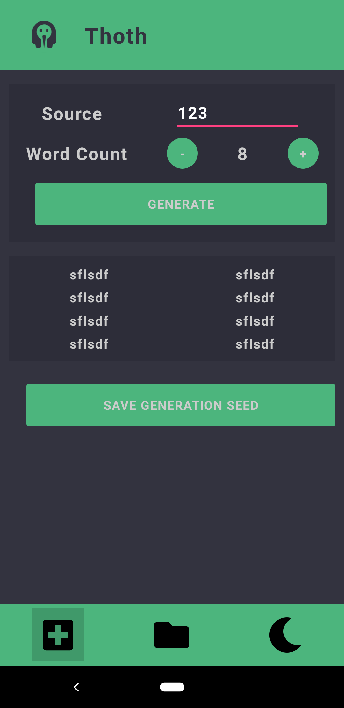
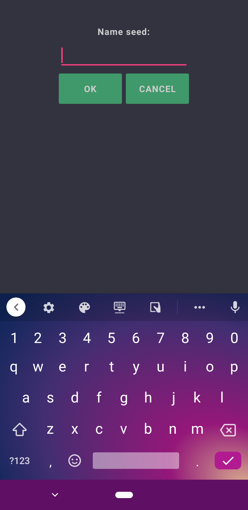
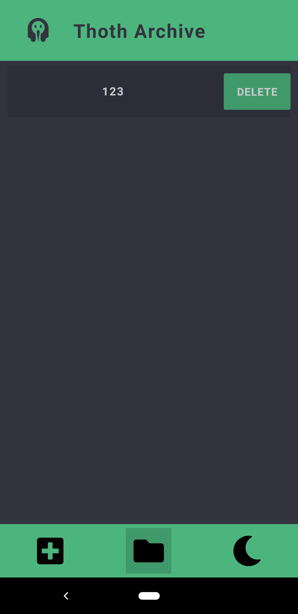

# Xamarin app implementation of Thoth
We're embedding Thoth library into a Xamarin.Forms app!

## TODO
### Alex
- [ ] Embed C++ Thoth library
### Chris
- [ ] Implement light and dark mode
- [ ] Connect Thoth functions to main screen
### Eric
- [ ] Bottom navigation bar
- [ ] Archives screen and storage

## Screens

### Splash Screen ( Android )

### Main View ( Android )

### Name Seed ( Android )

### Archive List ( Android )

